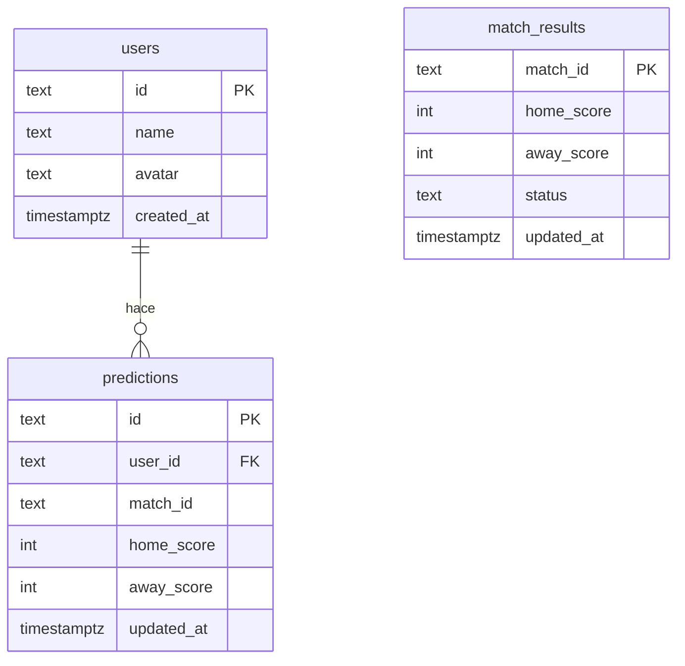
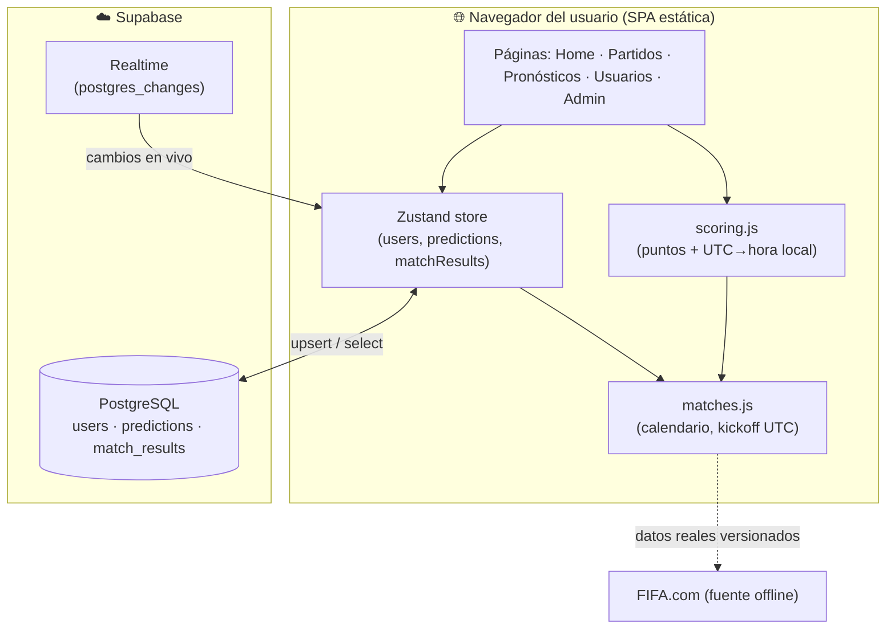
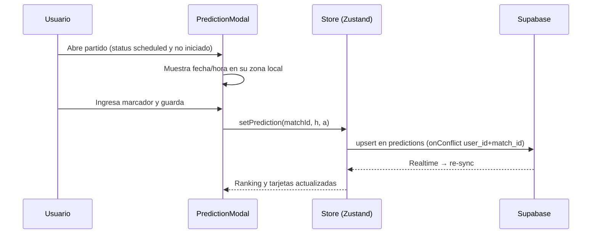
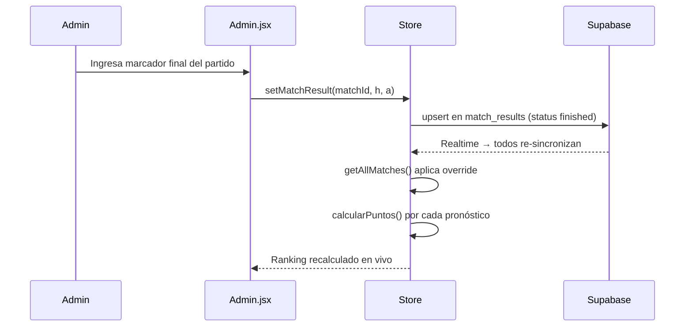
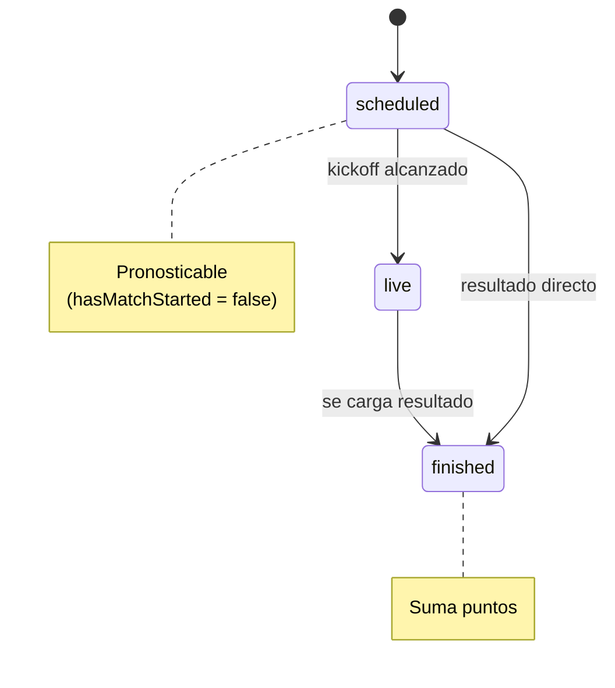

# PRD — TRIBIA 2026 ⚽

> **Product Requirements Document**
> App familiar de pronósticos del Mundial de Fútbol 2026 (USA · México · Canadá).

---

## 1. Visión general

**TRIBIA 2026** es una aplicación web para que un grupo (familia/amigos) compita
pronosticando los marcadores de los partidos del Mundial 2026. Cada participante
ingresa su predicción de marcador antes de que inicie cada partido; cuando el
partido termina, la app calcula los puntos y actualiza una tabla de posiciones
en tiempo real compartida entre todos los dispositivos.

### Objetivos
- Permitir a varios usuarios pronosticar marcadores de forma simple (móvil y desktop).
- Calcular puntos automáticamente y mostrar un ranking en vivo.
- Sincronizar datos entre dispositivos (Supabase) en tiempo real.
- Mostrar fecha y hora de cada partido **en la zona horaria local de quien abre la web**.

### No-objetivos
- No hay autenticación (es una app de uso familiar/confianza).
- No hay backend propio: es una SPA estática + Supabase.
- No se obtienen datos de FIFA en tiempo real (el calendario se versiona en el código).

---

## 2. Reglas del juego (scoring)

| Resultado del pronóstico | Puntos |
|---|---|
| Marcador exacto (local y visitante correctos) | **3 pts** 🎯 |
| Acierta solo al ganador o el empate | **1 pt** ✅ |
| Falla | **0 pts** ❌ |
| Partido sin resultado aún | — (pendiente) |

Implementado en `calcularPuntos()` en [src/utils/scoring.js](src/utils/scoring.js).

---

## 3. Stack tecnológico

| Capa | Tecnología |
|---|---|
| UI | React 18 + React Router 6 |
| Estado | Zustand (con `persist`) |
| Estilos | Tailwind CSS 3 |
| Build | Vite 5 |
| Backend/Datos | Supabase (PostgreSQL + Realtime) |
| Hosting | Estático (GitHub Pages, `base: /TRIBIA-2026-ANTUNEZ/`) |

---

## 4. Estructura del proyecto

```
TRIBIA-2026-ANTUNEZ/
├─ index.html
├─ vite.config.js              # base path para GitHub Pages
├─ tailwind.config.js
├─ supabase-schema.sql         # esquema de tablas + RLS
├─ .env.local                  # VITE_SUPABASE_URL / VITE_SUPABASE_ANON_KEY
└─ src/
   ├─ main.jsx                 # punto de entrada React
   ├─ App.jsx                  # rutas + sync inicial con Supabase
   ├─ index.css
   ├─ data/
   │  └─ matches.js            # CALENDARIO (104 partidos, kickoff en UTC)
   ├─ lib/
   │  └─ supabase.js           # cliente Supabase (null si no configurado)
   ├─ store/
   │  └─ index.js              # store Zustand: users, predictions, results, sync
   ├─ utils/
   │  └─ scoring.js            # puntos + conversión de fecha/hora a hora local
   ├─ components/
   │  ├─ layout/Layout.jsx
   │  ├─ matches/MatchCard.jsx
   │  └─ predictions/PredictionModal.jsx
   └─ pages/
      ├─ Home.jsx              # ranking + resumen
      ├─ Partidos.jsx          # listado/filtros de partidos
      ├─ Pronosticos.jsx       # mis pronósticos
      ├─ Usuarios.jsx          # gestión de participantes
      └─ Admin.jsx             # cargar resultados, import/export, Supabase
```

---

## 5. Modelo de datos

### 5.1 Calendario (en código) — `ALL_MATCHES`
Fuente de verdad del calendario, versionada en [src/data/matches.js](src/data/matches.js).
Datos reales de la fase de grupos tomados de FIFA.com.

```js
{
  id: "A1",                  // ID estable (grupo + posición / fase)
  group: "A",                // null en eliminatorias
  matchday: 1,               // jornada (1-3) en grupos
  home: "México", away: "Sudáfrica",
  homeFlag: "🇲🇽", awayFlag: "🇿🇦",
  kickoff: "2026-06-11T16:00:00.000Z",  // ⭐ instante exacto en UTC (ISO 8601)
  stadium: "Estadio Ciudad de México",
  city: "Ciudad de México",
  homeScore: 2, awayScore: 0,           // null si no se ha jugado
  status: "finished",        // 'scheduled' | 'live' | 'finished'
  phase: "group"             // group | r32 | r16 | qf | sf | third | final
}
```

> **Clave de diseño:** `kickoff` se guarda **siempre en UTC**. La UI lo convierte a
> la zona horaria del navegador del usuario con `toLocale*`, sin asumir offsets ni
> ciudades. Esto garantiza horas correctas en cualquier ubicación (móvil o desktop).

### 5.2 Datos dinámicos (Supabase)
Definidos en [supabase-schema.sql](supabase-schema.sql).



- `predictions.user_id` → FK a `users(id)` con `ON DELETE CASCADE`.
- `match_id` referencia el `id` del calendario en código (no es FK física, porque
  los partidos viven en `matches.js`, no en la base de datos).
- RLS abierto (lectura/escritura pública) por ser app sin autenticación.

### 5.3 Composición en runtime
El estado visible = calendario en código **+** overrides de Supabase:

```
getAllMatches() = ALL_MATCHES.map(m => ({ ...m, ...matchResults[m.id] }))
```

---

## 6. Arquitectura



### Sincronización
- Al cargar la app ([App.jsx](src/App.jsx)) se ejecuta `syncFromSupabase()` y se
  suscribe a `postgres_changes` de las 3 tablas.
- Cualquier cambio (nuevo usuario, pronóstico, resultado) dispara un re-fetch que
  actualiza el ranking en **todos los dispositivos** conectados.
- Si Supabase no está configurado (`.env.local` ausente), la app funciona en
  **modo local** persistiendo en `localStorage`.

---

## 7. Lógica de fecha/hora (zona horaria)

Toda la fecha/hora se deriva del campo `kickoff` (UTC). Funciones en
[src/utils/scoring.js](src/utils/scoring.js):

| Función | Propósito |
|---|---|
| `getMatchKickoff(match)` | `Date` del instante UTC del partido |
| `formatMatchLocalDate(match)` | Fecha en hora local del usuario (ej. "mié, 24 jun") |
| `formatMatchLocalTime(match)` | Hora en hora local del usuario (ej. "21:00") |
| `formatMatchLocalDateTime(match)` | Fecha + hora local combinadas |
| `isMatchToday(match)` | ¿El partido es hoy según el reloj del usuario? |
| `hasMatchStarted(match)` | ¿Ya comenzó? (cierra el botón Pronosticar) |
| `disponibleParaPronosticar(match)` | `scheduled` **y** aún no iniciado |

> El navegador conoce su zona horaria vía `Intl.DateTimeFormat().resolvedOptions().timeZone`.
> No se hace scraping ni se detecta el país: el `kickoff` UTC + la zona del navegador
> bastan para mostrar la hora correcta en cualquier lugar.

---

## 8. Workflows principales

### 8.1 Pronosticar un partido


### 8.2 Cargar un resultado (Admin)


### 8.3 Ciclo de estado de un partido


---

## 9. Páginas y responsabilidades

| Página | Función |
|---|---|
| **Home** | Tabla de posiciones (ranking) + resumen (jugados, en vivo, hoy, por jugar). |
| **Partidos** | Listado con filtros: Todos, 📅 Hoy, 🔴 En Vivo, por fase y por grupo. |
| **Pronósticos** | Pronósticos del usuario activo; filtros predicho/sin predecir/finalizado. |
| **Usuarios** | Alta/baja de participantes y selección del usuario activo. |
| **Admin** | Carga de resultados, import/export JSON, estado de Supabase. |

---

## 10. Configuración

`.env.local` (no se versiona):
```
VITE_SUPABASE_URL=https://<tu-proyecto>.supabase.co
VITE_SUPABASE_ANON_KEY=<anon-key>
```

Scripts ([package.json](package.json)):
```
npm run dev      # desarrollo
npm run build    # build de producción (dist/)
npm run preview  # previsualizar el build
```

Setup de base de datos: ejecutar [supabase-schema.sql](supabase-schema.sql) en el
SQL Editor de Supabase (crea tablas, índices y políticas RLS).

---

## 11. Decisiones de diseño clave

1. **`kickoff` en UTC como única fuente de verdad de tiempo** → evita ambigüedad de
   zonas horarias; la UI convierte a hora local del usuario.
2. **Calendario en código, datos dinámicos en Supabase** → el calendario es estable
   y versionable; solo usuarios/pronósticos/resultados necesitan persistencia compartida.
3. **Sin auth + RLS abierto** → simplicidad para uso familiar de confianza.
4. **Degradación a modo local** → la app sigue funcionando sin Supabase (localStorage).
5. **`match_id` como referencia lógica** (no FK física) → los partidos viven en el código.

---

## 12. Mejras futuras (backlog)

- Convertir countdown "comienza en X" por partido.
- Reglas de bonus (ej. acertar diferencia de goles).
- Bracket interactivo de eliminatorias con avance automático de equipos.
- Notificaciones/recordatorios antes del cierre de pronósticos.
- (Opcional) Backend/serverless para refrescar el calendario desde una fuente oficial.
